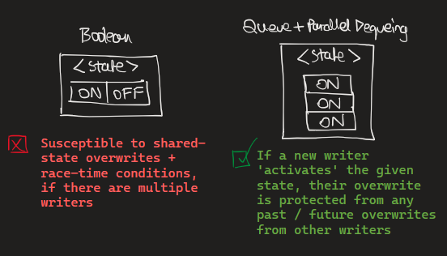

## 🐉⚙️ Docx #1: Repository Structure!
### 📝 Preface
Please view the `README.md` file before reading this documentation, as it will give you a brief introduction to this document's contents. 

---
### 🔍 Overview 
`RepositoryStructure.md` has been written to explain the black-box nature of how each directory tends to interact with one another, sometimes across the `ServerScripts` and `ClientScripts` boundaries.

This document will now provide examples of how modules were intended to interact with each other.

---

### 1. 🔐 "State Management + Server Validation"
- `ServerScripts.Physics` <-> `ServerScripts.Abilities`

`ServerScripts.Abilities` is responsible for validating whether a client is _supposed_ to be able to use an ability before they do! 

However, in order to do this, the state of the player must be **accurately** managed, which is done through the `ServerScripts.Physics` modules. 

For example, `ServerScripts.Physics.Stun.luau` is a system used to tag a player with a `Stunned` marker, which has a parallel thread that removes it after a certain given amount of time. 

The reason **why** I am using a system to track state like this, instead of using a single-state boolean variable is because: 

- (1) Any player's state is always in **shared state** (because any other player can attack them to change their `stunned` state) 

- (2) A player may be `stunned` whilst they are already in a `stunned` state

_If I used a boolean variable to track this `stunned` state then it would likely result in a race-time condition_

  

The solution is to represent a state as a **Queue** data structure that dequeues using parallel threads.

If any new writer activates a state again, it is logically guaranteed that their state change will never be intersected / interrupted by an old writer as the data structure we use maps True / False to whether the Queue is empty or not.

### 2. 🧮 "Raycast Hitboxing + Ability VFX"
- `ClientScripts.Ability` <-> `ServerScripts.Abilities`

`ServerScripts.Abilities` and `ClientScripts.Ability` modules work _synchronously_ to make sure the end-user is able to experience spells and attacks that make use of VFX properly.

For example, `ServerScripts.Fireball.luau` handles collision detection every frame using Raycasting + LERP'ing and `ClientScripts.FireballClient.luau` animates a fireball VFX using LERP'ing. 

Due to the fact that **both the Server and Client modules use LERP'ing algorithms**, the LERP'ing of the spell hitboxes and VFX can be synchronised by making their LERP speeds uniform, making attacks and spells seem accurately responsive. 

### 3. ⚡ "General VFX Modules + Ability VFX"
- `ClientScripts.Ability` <-> `ClientScripts.FX`

`CLientScripts.FX` is used to generate generic VFX like craters, explosions and etc... and returns the created instance so that it can be utilised by `ClientScripts.Ability`

This library is mainly to mainly to ensure that D.R.Y is followed in the code.
